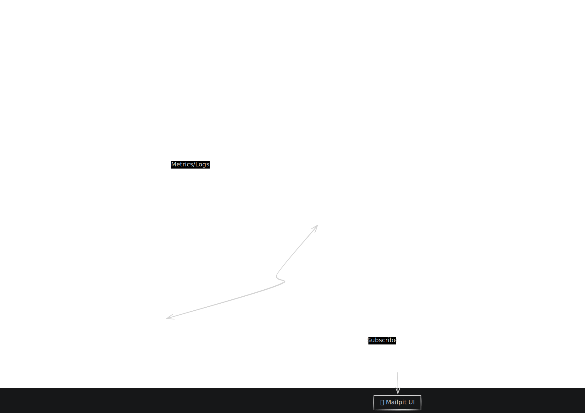
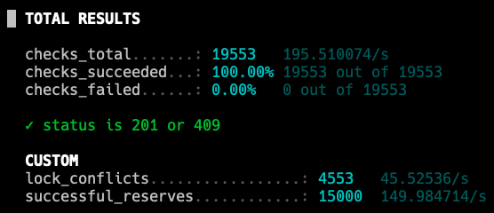
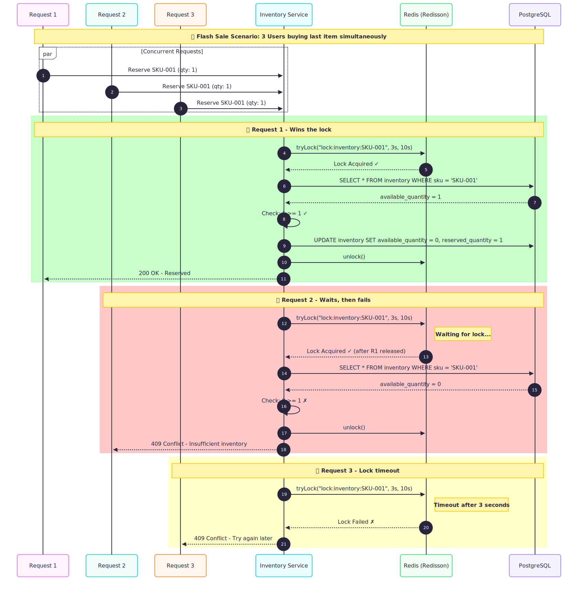

# High-Concurrency Retail Engine

<div align="center">


**A high-concurrency, distributed e-commerce platform built with microservices architecture**

[Architecture](#architecture) • [K6 test-user-journey](#k6-test-user-journey) • [Distributed Lock](#distributed-lock)

[Saga Pattern](#saga-pattern) • [Test Coverage by Service](#test-coverage-by-service) • [CI/CD Pipeline](#cicd-pipeline) • [Project Structure](#project-structure)

## Live links

## [Swagger](https://retail.yusufakcay.dev) - [Grafana Dashboard](https://monitor.yusufakcay.dev) - [Mailpit](https://mailpit.yusufakcay.dev)

> **Environment:** Oracle Cloud (ARM Ampere A1 • 4 OCPUs • 24 GB RAM)

</div>

## Overview

This project is a **high-concurrency e-commerce platform** designed to handle thousands of simultaneous orders without data inconsistencies like overselling. It demonstrates real-world distributed systems patterns including:

- **AI-Powered Semantic Search** - Implemented a vector search engine using Spring AI and pgvector, enabling conceptual product discovery (e.g., "thirsty" finding "Coke") beyond simple keyword matching.
- **Observability** - OpenTelemetry tracing, Prometheus metrics, Grafana dashboards, Loki logging, and Tempo for distributed tracing.
- **Distributed Locking** - Redisson for preventing concurrent inventory modifications.
- **Event-Driven Architecture** - Asynchronous communication via Apache Kafka across all services.
- **Saga Pattern** - Distributed transaction management for order fulfillment.
- **Idempotency** - Ensuring exactly-once processing for critical operations.
- **Real Payment Integration** - Production-ready Stripe integration with webhooks.
- **Circuit breaker** - Resilience4j integration for fault-tolerant calls to inventory/payment services.
- **Kafka DLQ** - Dead letter queues for handling failed message processing (e.g., notification retries).
- **Fallback Handling** - Graceful degradation when services are unavailable.
- **Testing Strategy** - 120+ tests covering unit, integration (Testcontainers), and load testing with k6.
- **Scheduler** - Background job for expiring unpaid orders.
- **Rate Limiting** - Configurable per-route limits using Redis.
- **API Gateway & Routing** - Centralized entry point for all microservices, with path-based routing.
- **API Documentation** - Live OpenAPI (Swagger) specification.

## Architecture



**Key Architectural Decisions:**

- **Loose Coupling:** Service-to-service communication is primarily asynchronous (Kafka).
- **Fault Isolation:** Failures in the Notification or Payment service do not block Order creation.
- **Scalability:** Stateless services allow horizontal scaling behind the Gateway.

```yaml
Routes:
  /auth/**      → Login/Register (Public)
  /users/**     → User Service (Authenticated)
  /products/**  → Product Service (Public: GET, Admin: POST/PUT/DELETE)
  /orders/**    → Order Service (Authenticated)
  /inventory/** → Inventory Service (Admin only)
```

[↑ Back to Top](#high-concurrency-retail-engine)

## K6 test-user-journey

<div align="center">
  <video src="https://github.com/user-attachments/assets/fbd5483a-0693-4abd-8246-644a6731581c" width="100%" muted autoplay loop playsinline>
  </video>
</div>

| Metric             | Result      |
| :----------------- | :---------- |
| **P95 Latency**    | **400ms**   |
| **Data Integrity** | **100%**    |
| **Error Rate**     | **< 0.01%** |

[↑ Back to Top](#high-concurrency-retail-engine)

## Distributed Lock

To prevent overselling during high-concurrency events like flash sales, I implemented a distributed locking mechanism using Redisson. By wrapping the database transaction within a lock boundary, I ensured strict data consistency across multiple service instances.

The Result: Successfully handled k6 load test with zero inventory inconsistencies (15K Stock).





[↑ Back to Top](#high-concurrency-retail-engine)

## Saga Pattern

Managing a distributed transaction across the Order, Inventory, and Payment services requires a robust Saga Pattern. This ensures that if a payment fails or stock is unavailable, the system automatically triggers compensating transactions to maintain a consistent state.

Communication: Orchestrated via Apache Kafka to decouple services and ensure high availability.

Reliability: Implemented Idempotent Consumers to handle potential network retries without duplicating orders or payments.


[↑ Back to Top](#high-concurrency-retail-engine)

### Test Coverage by Service

```
✅ Gateway Service       - 13 tests
✅ User Service          - 30 tests
✅ Product Service       - 24 tests
✅ Inventory Service     - 19 tests
✅ Order Service         - 16 tests
✅ Payment Service       - 19 tests
✅ Notification Service  - 8 tests
```

[↑ Back to Top](#high-concurrency-retail-engine)

## CI/CD Pipeline


**Intelligent Monorepo Testing & Deployment:**

### 1. **Change Detection** (Optimized for Monorepo)

```yaml
Trigger: Push to main/develop or PR
Action:
  - Detect which services changed
  - Only run CI for affected services
```

### 2. **Parallel Service CI** (Test + Build)

Each service runs independently in parallel:

```
User Service          Product Service       Inventory Service     ...
    ↓                      ↓                      ↓
 ✅ Maven Test        ✅ Maven Test          ✅ Maven Test
    ↓                      ↓                      ↓
 Test Reports         Test Reports           Test Reports
    ↓                      ↓                      ↓
 Build JAR            Build JAR              Build JAR
    ↓                      ↓                      ↓
 Multi-Arch Docker    Multi-Arch Docker     Multi-Arch Docker
 (amd64 + arm64)      (amd64 + arm64)       (amd64 + arm64)
    ↓                      ↓                      ↓
  Push to DockerHub   Push to DockerHub    Push to DockerHub
```

**Key Optimizations:**

- **JVM Cache**: Maven dependency cache via GitHub Actions (speeds up builds by ~60%)
- **Multi-Architecture Builds**: Automatic ARM64 & AMD64 image builds (OCI A1 Ampere ARM support)
- **Fail Fast**: If any service test fails, deployment is blocked immediately

### 3. **Conditional Deployment** (main branch only)

```yaml
Trigger: Successful tests on main branch
Prerequisites:
  - All service tests pass (or skip if unchanged)
  - No test failures → blocks deployment

Steps: 1. SCP infrastructure files to OCI
  2. SSH into OCI server
  3. Inject secrets via .env file (never in code)
  4. Pull latest Docker images (from DockerHub)
  5. docker compose up -d (rolling restart)
  6. Automatic cleanup (--remove-orphans)
```

[↑ Back to Top](#high-concurrency-retail-engine)

## Project Structure

```
high-concurrency-retail-engine/
├── services/
│   ├── gateway-service/        # API Gateway
│   ├── user-service/           # Authentication
│   ├── product-service/        # Product catalog
│   ├── inventory-service/      # Stock management
│   ├── order-service/          # Order processing
│   ├── payment-service/        # Stripe integration
│   └── notification-service/   # Email notifications
├── infrastructure/
│   ├── init-db.sql            # Database initialization
│   ├── k6/                    # Load testing scripts
│   └── observability/         # Grafana, Prometheus configs
├── docs/
│   └── **/                    # readme assets
├── docker-compose.yml         # Development environment
├── docker-compose-prod.yml    # Production environment
├── .github/
│   └── workflows/             # CI/CD pipelines
│       ├── ci.yml             # Main orchestrator
│       ├── user-service-ci.yml
│       ├── product-service-ci.yml
│       ├── inventory-service-ci.yml
│       ├── order-service-ci.yml
│       ├── payment-service-ci.yml
│       ├── gateway-service-ci.yml
│       └── notification-service-ci.yml
└── README.md
```

[↑ Back to Top](#high-concurrency-retail-engine)
